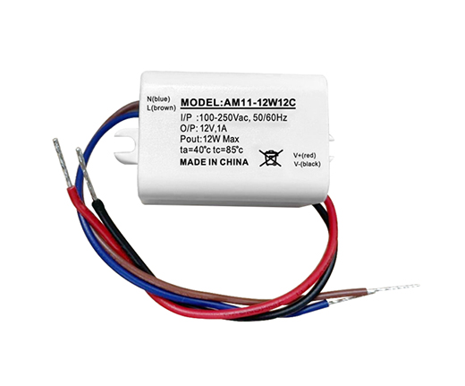

**INSTRUCTIONS**:

Purchase an RS485 to WiFi module. There are many available - in board form, as a packaged module, as a DIN unit for mounting on a rail. 

The module I used is the Elfin EW11 RS486 WiFi Serial Server from Hi-Flying.com. http://www.hi-flying.com/elfin-ew10-elfin-ew11

I sourced my unit from Aliexpress, with supporting antenna, connector cables and mounting block: https://www.aliexpress.com/item/1005006252294801.html but this unit is available from many vendors.

**Overview**:

The basic procedure is: to connect the module to power, to configure it to use your local WiFi AP, to set the operating parameters on the EW11, to connect it to the Midea MODBUS, to configure Home Assistant to poll the device and to check the results in Home Assistant.

To power the EW11, I used an AM11-12W12C 220V AC to 12V DC transformer. It has an output of 1000mW - more than enough to drive the EW11. Again, I sourced this component from Aliexpress, but any number of modules would do the same job: https://www.aliexpress.com/item/1005005937263063.html

**Step 1: Connect the EW11 to the Midea Heat Pump**

- Power the unit off at the mains connector
- Remove the right-hand cover (as seen when facing the control panel) from the heat pump unit on top of the water tank
- Inside the cover, locate the MODBUS cables, AC 220V connectors.

The MODBUS cables are black (MODBUS A), gray (MODBUS B) and yellow (GND)
The connections for the EW11 are:

MODBUS Yellow cable (GND) shares the screw block with 12VDC black/negative wire

Mount the transformer and the RS485 module securely to the heat pump. For this I used 3M VHB mounting tape. This 3M product is strong, flexible, but able to be removed if necessary. I have had units mounted over a dozen years and the bond is as strong today as the day I installed it. It will bond to almost any clean surface.

https://www.3mnz.co.nz/3M/en_NZ/vhb-tapes-nz/

Be sure to mount the RS485 module in a way that you can orient the antenna in the same plane as your AP/WiFi router - in other words, if your router has its antenna vertically, make the RS485 antenna vertical too - it will ensure the best connection. The unit is inside a metal casing, surrounded by electronics which can interfere with the signal.

- Once the device is connected and securely mounted, you can power the heat pump back up and connect to the RS485 module

**Configuration**

